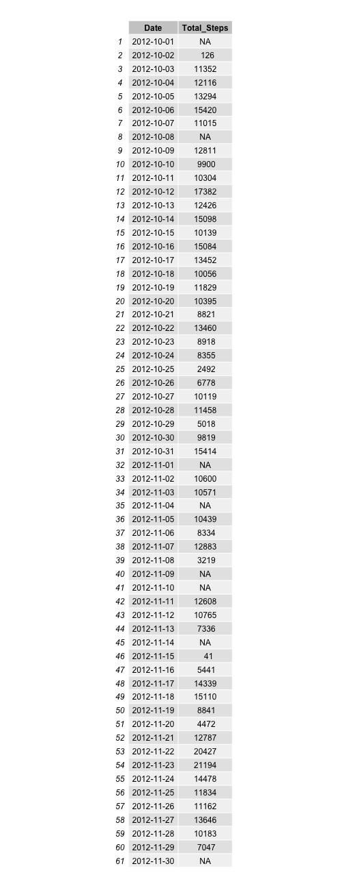
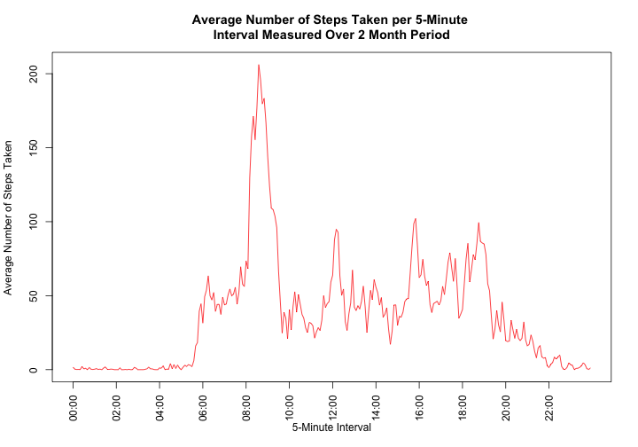
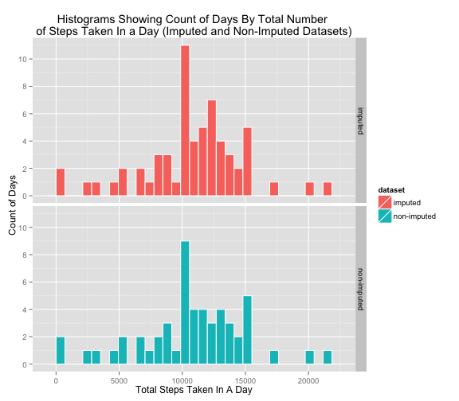

## Loading and preprocessing the data


```r
# load needed libraries
library(knitr)
library(dplyr, warn.conflicts=FALSE)
library(grid)
library(ggplot2)
library(gridExtra) 
library(lubridate)
library(stringr)


# Check to see if the activity.csv file is around.
if(!file.exists("activity.csv"))  {
        
        # Check if the "activity.zip" file is around. If it is in the
        # current working directory, then just unzip the file, if the zip
        # file isn't around, download it and then unzip it.
        
        if(!file.exists("activity.zip")) {
                fileURL <- "https://d396qusza40orc.cloudfront.net/repdata%2Fdata%2Factivity.zip"
                download.file(fileURL, destfile="activity.zip", method="curl", mode="wb")
                dateDownloaded <- date()
                print(paste("Downloaded Activity monitoring data zip file on", dateDownloaded))
                }
        
        # Unzip the activity.zip/activity.csv file so it can be read into R.
        unzip("activity.zip")        
        }
```

*1. Load the data (i.e. read.csv())*  
  

```r
activity <- read.csv("activity.csv")
```

*2. Process/transform the data (if necessary) into a format suitable for your analysis*  
  

```r
# add an interval_string field to hold a normalized string value of the interval 
activity$interval_string <- as.character(activity$interval)

# normalize the interval string field so each entry is a 4 character interval string
# leading zeros are now OK cause this field is character type
activity[,4] <- str_c(str_dup("0", 4 - str_length(activity[,4])),activity[,4])

# now lubridate has necessary data to generate valid date/time values
# date field + 4 character interval strings into date_time field
activity$date_time <- ymd_hm(paste(activity[,2], activity[,4]))
```

## What is mean total number of steps taken per day?
*For this part of the assignment, you can ignore the missing values in the dataset.*  
  
*1. Calculate the total number of steps taken per day*  
  

```r
# the following three lines sum total steps by day for the Total Number of Steps Taken per Day table
activity.by.date <- group_by(activity, date)
activity.summed <- summarise(activity.by.date, total = sum(steps))
activity.sum <- rename(activity.summed, Total_Steps=total, Date=date)
```

###Total Number of Steps Taken per Day

```r
grid.table(activity.sum,
           show.rownames = FALSE,
           show.vlines = TRUE, 
           show.hlines = TRUE, 
           h.odd.alpha = 0.1, 
           h.even.alpha = 1)
```



*2. If you do not understand the difference between a histogram and a barplot, research the difference between them. Make a histogram of the total number of steps taken each day*  
  

```r
#library(ggplot2)
g <- ggplot(activity.summed, aes(total))
g <- g + geom_histogram(color="white") +
        xlab("Total Steps Taken In A Day") +
        ylab("Count of Days") +
        scale_y_continuous(breaks=c(0,2,4,6,8,10), labels=c(0,2,4,6,8,10)) +
        ggtitle("Histogram Showing Count of Days By\nTotal Number of Steps Taken In a Day") +
        geom_rug(aes(total))
```


 

*3. Calculate and report the mean and median of the total number of steps taken per day*  
  

```r
mean_steps <- as.integer(mean(activity.summed$total, na.rm = TRUE))
median_steps <- median(activity.summed$total, na.rm = TRUE)
```
  
Mean Total Steps Taken per Day  
10766  
  
Median Total Steps Taken per Day  
10765  


## What is the average daily activity pattern?

*1. Make a time series plot (i.e. type = "l") of the 5-minute interval (x-axis) and the average number of steps taken, averaged across all days (y-axis)*  
  

```r
# the following two lines calculate mean steps by time interval for the following time series plot
activity.by.interval <- group_by(activity, interval)
activity.by.interval.avg <- summarise(activity.by.interval, total = mean(steps, na.rm = TRUE))
```


```r
plot(activity.by.interval.avg, 
     xlab="5-Minute Interval",
     ylab="Average Number of Steps Taken",
     type="l",
     main="Average Number of Steps Taken per 5-Minute\nInterval Measured Over 2 Month Period")
```

 

*2. Which 5-minute interval, on average across all the days in the dataset, contains the maximum number of steps?*  
  

```r
# find the integer portion of the max average from the averages by time interval
max_avg_steps <- as.integer(activity.by.interval.avg[activity.by.interval.avg$total ==                                                                            max(activity.by.interval.avg$total),2])
# use the max avg step value to find which time interval contains that value
max_avg_steps_interval <- activity.by.interval.avg[activity.by.interval.avg$total ==                                                                            max(activity.by.interval.avg$total),1]

# the next three lines of code take the time interval corresponding to the max average steps
# and reformats the interval into a hour:minute time value on the 24-hour clock

# change from a dply tbl_df to an integer so str_length can coerce to a character vector
max_avg_steps_interval <- max_avg_steps_interval[[1]]
# change the intervals to character and add "0" prefixes to make 4 char in length
max_avg_steps_time <- str_c(str_dup("0", 4 - str_length(max_avg_steps_interval)), max_avg_steps_interval)
# add a colon between the hour and the minutes for the time variable
max_avg_steps_time <- str_c(str_sub(max_avg_steps_time,1,2), ":", str_sub(max_avg_steps_time,3,4))
```

The 5-minute interval, averaged across all days in the dataset, that contains the maximum number of steps is interval 835 which maps to the time 08:35 on a 24 hour clock. The averaged step count at time interval 835 is 206 steps.

## Imputing missing values
*Note that there are a number of days/intervals where there are missing values (coded as NA). The presence of missing days may introduce bias into some calculations or summaries of the data.*  
  
*1. Calculate and report the total number of missing values in the dataset (i.e. the total number of rows with NAs)*


```r
na_count <- count(activity[is.na(activity),])
```
There are 2304 missing values in the dataset.


*2. Devise a strategy for filling in all of the missing values in the dataset. The strategy does not need to be sophisticated. For example, you could use the mean/median for that day, or the mean for that 5-minute interval, etc.*


```r
# pull out all rows that have NA for step observations 
activity.na <- activity[is.na(activity),]
# group by the date
activity.na.by.date <- group_by(activity.na, date)
# count the number of NAs by day
activity.na.by.date.summed <- count(activity.na.by.date, date)
# add a day of the week field
activity.na.by.date.summed$day_of_week <- wday(as.Date(activity.na.by.date.summed$date), label=TRUE)
# reorder the fields into the order I want them displayed in the grid.table output
activity.na.by.date.summed <- select(activity.na.by.date.summed, day_of_week, date, n)
```
There are 8 days of completely missing values spread across various days of the week.


```r
grid.table(activity.na.by.date.summed,
           show.rownames = FALSE,
           show.vlines = TRUE, 
           show.hlines = TRUE, 
           h.odd.alpha = 0.1, 
           h.even.alpha = 1)
```

 
  
It seems that taking the mean for a specific time interval of a specific day of the week and then using that value to replace the corresponding missing value for a specific time interval for a specific day of the week should be minimally acceptable. 

For example, select only Mondays then find the mean for all Mondays between 08:00 to 08:05. Use this mean value to fill in any missing data for Mondays and for the time interval 08:00 to 08:05. Repeat this process for each time interval for each day of the week.  
  
I chose this algorithm to impute missing values.  
  
Future research might take a more sophisticated approach to imputing missing values and could be implemented in a follow-up project.  
  
*3. Create a new dataset that is equal to the original dataset but with the missing data filled in.*


```r
# add a field that contains the day of the week for each measurement
activity$day_of_week <- wday(as.Date(activity$date), label=TRUE)
# group by the day of the week and by the interval
activity_by_day_of_week_interval <- group_by(activity, day_of_week, interval)
# calculate the mean for each interval for each day of the week
activity_by_day_of_week_interval.summed <- summarise(activity_by_day_of_week_interval, total = mean(steps, na.rm=TRUE))

# split out only the rows with NA in the steps field
activity.nas <- activity[is.na(activity),]
# split out only the rows without NA in the steps field
activity.no.nas <- activity[complete.cases(activity),]
# use the day-of-the-week and the interval to merge the mean of that 5 minute period for that 
# day-of-the-week next to cooresponding day-of-the-week and interval that contain NAs
activity.nas.merged <- merge(activity.nas, activity_by_day_of_week_interval.summed, 
                             by.x = c("day_of_week", "interval"), by.y = c("day_of_week", "interval"))
# sort the rows based on date and interval to match original sort order
activity.nas.merged.ordered <- arrange(activity.nas.merged, date_time, interval)
# remove the old steps field with the NAs, keep the total field that will become the new steps field
activity.nas.merged.reordered <- select(activity.nas.merged.ordered,
                                        total, date, interval, interval_string, date_time, day_of_week)
# change the total field name to steps
activity.nas.merged.reordered <- rename(activity.nas.merged.reordered, steps=total)

# combine the original rows that didn't have NAs with the rows that have had their NAs replaced
# with mean values
activity2 <- rbind(activity.no.nas, activity.nas.merged.reordered)
# order the rows back to original ordering
activity2 <- arrange(activity2, date_time, interval)
```


*4. Make a histogram of the total number of steps taken each day and Calculate and report the mean and median total number of steps taken per day.*  


```r
# the following three lines sum total steps by day for the Total Number of Steps Taken per Day table
# but using the dataset that now contains the imputed values
activity2.by.date <- group_by(activity2, date)
activity2.summed <- summarise(activity2.by.date, total = sum(steps))
activity2.sum <- rename(activity2.summed, Total_Steps=total, Date=date)
```


```r
grid.table(activity2.sum,
           show.rownames = FALSE,
           show.vlines = TRUE, 
           show.hlines = TRUE, 
           h.odd.alpha = 0.1, 
           h.even.alpha = 1)
```


```r
#library(ggplot2)
g1 <- ggplot(activity2.summed, aes(total))
g1 <- g1 + geom_histogram(color="white") +
        xlab("Total Steps Taken In A Day") +
        ylab("Count of Days") +
        scale_y_continuous(breaks=c(0,2,4,6,8,10), labels=c(0,2,4,6,8,10)) +
        ggtitle("Histogram Showing Count of Days By\nTotal Number of Steps Taken In a Day (Imputed Dataset)") +
        geom_rug(aes(total))
```


 


```r
mean_steps2 <- as.integer(mean(activity2.summed$total, na.rm = TRUE))
median_steps2 <- median(activity2.summed$total, na.rm = TRUE)
```
  
Mean Total Steps Taken per Day (Imputed Dataset)  
10766  
  
Median Total Steps Taken per Day (Imputed Dataset)  
10765  


*Do these values differ from the estimates from the first part of the assignment? What is the impact of imputing missing data on the estimates of the total daily number of steps?*

The mean and median of total steps taken per day are the _same_ between the unimputed dataset and the imputed dataset.

The imputed dataset contains 8 more days of step measurements so the histogram of the imputed dataset shows 8 addional days in the counts but follows the same shape (distribution) as the histogram with unimputed data and 8 fewer days of step measurements.


## Are there differences in activity patterns between weekdays and weekends?

*For this part the weekdays() function may be of some help here. Use the dataset with the filled-in missing values for this part.*  
  
*1. Create a new factor variable in the dataset with two levels – “weekday” and “weekend” indicating whether a given date is a weekday or weekend day.*  
  

```r
# pull out only the rows with a date from a weekend day
activity2.weekend <- filter(activity2, day_of_week %in% c("Sat", "Sun"))
# add a field and push the value of weekend into the new field
activity2.weekend$week <- "weekend"
# group these weekend days by interval
activity2.weekend.interval <- group_by(activity2.weekend, interval)
# calculate the mean steps for each of the intervals for these weekend days
activity2.weekend.interval.avg <- summarise(activity2.weekend.interval, total = mean(steps, na.rm = TRUE))
# add a field and push the value of weekend into the new field
activity2.weekend.interval.avg$week <- "weekend"

# pull out only the rows with a date from a weekday
activity2.weekday <- filter(activity2, day_of_week %in% c("Mon", "Tues", "Wed", "Thurs", "Fri"))
# add a field and push the value of weekday into the new field
activity2.weekday$week <- "weekday"
# group these weekday days by interval
activity2.weekday.interval <- group_by(activity2.weekday, interval)
# calculate the mean steps for each of the intervals for these weekday days
activity2.weekday.interval.avg <- summarise(activity2.weekday.interval, total = mean(steps, na.rm = TRUE))
# add a field and push the value of weekday into the new field
activity2.weekday.interval.avg$week <- "weekday"

# put the weekend and weekday rows back together
activity2.weeks <- rbind(activity2.weekend, activity2.weekday)
# sort the rows back into original date/time ordering
activity2.weeks <- arrange(activity2.weeks, date_time)

# put the weekend and weekday rows of averages back together
activity2.weeks.interval.avg <- rbind(activity2.weekend.interval.avg, activity2.weekday.interval.avg)
# factor the weekend/weekday field values
activity2.weeks.interval.avg <- transform(activity2.weeks.interval.avg, week = factor(week))
```

*2. Make a panel plot containing a time series plot (i.e. type = "l") of the 5-minute interval (x-axis) and the average number of steps taken, averaged across all weekday days or weekend days (y-axis). See the README file in the GitHub repository to see an example of what this plot should look like using simulated data.*  
  
  *<b>Your plot will look different from the one above</b> (https://github.com/rdpeng/RepData_PeerAssessment1) because you will be using the activity monitor data. Note that the above plot (https://github.com/rdpeng/RepData_PeerAssessment1) was made using the lattice system but you can make the same version of the plot using any plotting system you choose.*
  

```r
g2 <- ggplot(activity2.weeks.interval.avg, aes(x=interval, y=total, group=week))
g2 <- g2 + geom_line(aes(color=week)) +
        facet_grid(week ~ .) +
        xlab("5-Minute Interval") +
        ylab("Average Number of Steps Taken") +
        theme(legend.title = element_blank()) +
        theme(axis.text.x=element_text(angle=50, vjust=1.0, hjust=1.0)) +
        scale_x_continuous(breaks=c(0,100,200,300,400,500,600,700,800,900,1000,1100,1200,
                                    1300,1400,1500,1600,1700,1800,1900,2000,2100,2200,2300,2400),
                           labels=c(0,100,200,300,400,500,600,700,800,900,1000,1100,1200,
                                    1300,1400,1500,1600,1700,1800,1900,2000,2100,2200,2300,2400)) +
        ggtitle("Average Number of Steps Taken per 5-Minute Interval\nMeasured Over 2 Month Period (Imputed Dataset)")
```


 


### System Details

```r
session_details <- sessionInfo()
session_details
```

```
## R version 3.2.0 (2015-04-16)
## Platform: x86_64-apple-darwin13.4.0 (64-bit)
## Running under: OS X 10.10.3 (Yosemite)
## 
## locale:
## [1] en_US.UTF-8/en_US.UTF-8/en_US.UTF-8/C/en_US.UTF-8/en_US.UTF-8
## 
## attached base packages:
## [1] grid      stats     graphics  grDevices utils     datasets  methods  
## [8] base     
## 
## other attached packages:
## [1] stringr_1.0.0   lubridate_1.3.3 gridExtra_0.9.1 ggplot2_1.0.1  
## [5] dplyr_0.4.1     knitr_1.10.5   
## 
## loaded via a namespace (and not attached):
##  [1] Rcpp_0.11.6      magrittr_1.5     MASS_7.3-40      munsell_0.4.2   
##  [5] colorspace_1.2-6 plyr_1.8.2       tools_3.2.0      parallel_3.2.0  
##  [9] gtable_0.1.2     DBI_0.3.1        lazyeval_0.1.10  assertthat_0.1  
## [13] digest_0.6.8     reshape2_1.4.1   formatR_1.2      memoise_0.2.1   
## [17] evaluate_0.7     mime_0.3         labeling_0.3     stringi_0.4-1   
## [21] scales_0.2.4     markdown_0.7.7   proto_0.3-10
```
